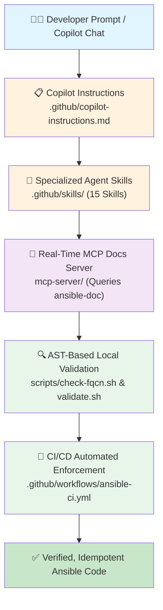

# 🛡️ Ansible-Quak: Enterprise Anti-Hallucination Ansible Framework

> **Production-Grade Ansible Automation for Enterprise Network, Cloud & Security Engineering.**  
> Pre-configured with **GitHub Copilot Skills, Custom Instructions, AST-based FQCN Validation, and CI/CD Gates** to eliminate AI hallucinations across **Akamai CDN, F5 BIG-IP, Zscaler Zero Trust, Jira ITSM, AWS, Azure, and GCP**.

---

## 🎯 Purpose & Architecture

When writing complex enterprise Ansible playbooks with GitHub Copilot or LLM agents, models frequently hallucinate:
- Invented module names (e.g., `akamai_purge`, `bigip_pool`, `jira_ticket`)
- Fake parameters and invalid state options
- Missing Fully Qualified Collection Names (FQCN)
- Deprecated loops (`with_items:`) and syntax (`{{ }}` inside `when:`)

**Ansible-Quak** solves this through a **5-Layer Defense Architecture**:



---

## 🏢 Enterprise Technologies Covered

| Domain | Collections | Key Capabilities & Modules |
|---|---|---|
| **Akamai CDN & DNS** | `akamai.edgegrid` | Fast Purge (CCU v3 via `cache_purge`), Edge DNS (`dns_record`), Property Manager (`property_activation`) |
| **F5 BIG-IP ADC** | `f5networks.f5_modules` | Declarative AS3 (`bigip_as3_deploy`), Maintenance Drain (`bigip_pool_member`), VIPs (`bigip_virtual_server`), SSL certs |
| **Zscaler Cloud Security**| `zscaler.ziacloud`<br>`zscaler.zpacloud` | ZIA URL filtering (`zia_url_categories`, `zia_url_filtering_rules`), ZPA App Segments (`zpa_application_segment`, `zpa_server_group`) |
| **Jira ITSM & Change** | `community.general` | Change ticket creation, approval status gating, audit comments, state transitions (`community.general.jira`) |
| **Amazon Web Services** | `amazon.aws` | EC2 instances (`ec2_instance`), S3 storage, Route53 DNS, IAM roles, VPC transit gateways |
| **Microsoft Azure** | `azure.azcollection` | Virtual Machines (`azure_rm_virtualmachine`), Virtual Networks (`azure_rm_virtualnetwork`), NSGs |
| **Google Cloud (GCP)** | `google.cloud` | Compute Engine (`gcp_compute_instance`), Cloud DNS, Cloud Storage buckets |
| **Linux & Core Systems** | `ansible.builtin`<br>`ansible.posix` | Package management (`apt`, `dnf`), Systemd services, Firewalld, Sysctl kernel tuning, SSH hardening |

---

## 🤖 GitHub Agent Skills Reference (`.github/skills/`)

Copilot Agent Mode automatically matches and loads these skills based on your prompt:

1. **`ansible-akamai`**: Fast Purge, Edge DNS zones, Property Manager PAPI, and `.edgerc` authentication.
2. **`ansible-f5-bigip`**: F5 ADC automation, AS3 declarations, pool member drain/maintenance, and SSL renewals.
3. **`ansible-zscaler`**: ZIA URL filtering, ZPA Zero Trust App Segments, connector groups, and activation steps.
4. **`ansible-jira`**: ITSM change management workflows, ticket creation, approval gates, and block/rescue error handling.
5. **`ansible-multi-cloud`**: AWS, Azure, and GCP compute and networking orchestration.
6. **`ansible-playbook`**: Master playbook authoring skill with decision trees and pre-flight asserts.
7. **`ansible-role`**: Galaxy directory standard, 22-level variable precedence, and Molecule testing.
8. **`ansible-jinja2`**: Complete Jinja2 filter whitelist, loop scopes, and avoidance of hallucinated filters.
9. **`ansible-security-hardening`**: CIS benchmark automation, SSH hardening, auditd, and kernel sysctl tuning.
10. **`ansible-linux-admin`**: Daily sysadmin tasks (users, groups, systemd units, storage, cron/timers).
11. **`ansible-vault`**: Zero-leakage secrets management, inline encryption (`!vault`), and `no_log: true`.
12. **`ansible-performance`**: Strategies (`free`, `linear`), async polling, SSH pipelining, and forks tuning.
13. **`ansible-containers`**: Docker containers (`community.docker`), Compose v2, and Kubernetes (`kubernetes.core`).
14. **`ansible-troubleshoot`**: Systematic debugging flowchart, verbosity levels, and common error resolution.
15. **`ansible-ci-cd-deployment`**: Rolling updates (`serial:`), canary releases, and zero-downtime deployments.

---

## 📁 Repository Structure

```text
.
├── .github/
│   ├── copilot-instructions.md      # Auto-loaded Copilot rules & anti-hallucination matrix
│   ├── mcp.json                     # MCP server definition for real-time ansible-doc tool calls
│   ├── skills/                      # 15 Comprehensive GitHub Agent Skills
│   │   ├── ansible-akamai/          # Akamai Fast Purge & DNS automation
│   │   ├── ansible-f5-bigip/        # F5 ADC, AS3 & Pool Member drain
│   │   ├── ansible-zscaler/         # ZIA & ZPA Zero Trust automation
│   │   ├── ansible-jira/            # Jira ITSM ticket lifecycle & approval gate
│   │   ├── ansible-multi-cloud/     # AWS, Azure & GCP provisioning
│   │   └── ...                      # Playbooks, Roles, Linux, Security, etc.
│   └── workflows/
│       ├── ansible-ci.yml           # CI validation pipeline (Lint, Syntax, FQCN, Modules)
│       └── auto-fix.yml             # Automatic lint suggestions
├── inventories/
│   └── dev/
│       ├── hosts.yml                # Environment host inventory
│       └── group_vars/all.yml       # F5, Akamai, Zscaler, Jira & Cloud provider configurations
├── playbooks/
│   ├── site.yml                     # Master execution playbook
│   ├── webserver.yml                # Sample application playbook
│   └── enterprise_edge_datacenter_orchestration.yml  # Full Jira + F5 + Zscaler + Akamai pipeline
├── examples/
│   ├── f5-as3-declaration.yml       # F5 AS3 Declarative App deployment
│   ├── akamai-purge-dns.yml         # Akamai Fast Purge and Edge DNS CNAME
│   ├── zscaler-security-policy.yml  # ZIA URL filtering and ZPA App Segments
│   ├── jira-change-management.yml   # Jira change ticket lifecycle
│   ├── gold-standard-tasks.yml      # 10 Reference system administration tasks
│   └── gold-standard-role/          # Complete enterprise role with Molecule tests
├── scripts/
│   ├── check-fqcn.sh                # Shell launcher for FQCN verification
│   ├── check-fqcn.py                # AST-based Python scanner for non-FQCN modules
│   ├── verify-modules.sh           # Verifies all FQCN modules exist via ansible-doc
│   └── validate.sh                  # Complete 6-stage validation suite
├── mcp-server/
│   ├── ansible-docs-server.py       # Custom Model Context Protocol (MCP) server
│   └── requirements.txt             # MCP server dependencies
├── ansible.cfg                      # Tuned configuration (YAML callback, pipelining, smart facts)
├── requirements.yml                 # Pinned enterprise collections
├── Makefile                         # Unified dev commands
└── README.md
```

---

## ⚡ Quick Start & Verification

### 1. Install Dependencies & Collections
```bash
make install
```

### 2. Run AST FQCN Verification
```bash
./scripts/check-fqcn.sh
```

### 3. Run Full Test Suite
```bash
make validate
```

---

## 🚀 Push to GitHub (`Ansible-Quak`)

This repository is pre-configured with remote `origin` pointing to `https://github.com/lavkushry/Ansible-Quak.git`:

```bash
git add .
git commit -m "feat: complete enterprise anti-hallucination ansible framework for akamai, f5, zscaler, jira, and multi-cloud"
git push -u origin main
```

---

## 📄 License
MIT
